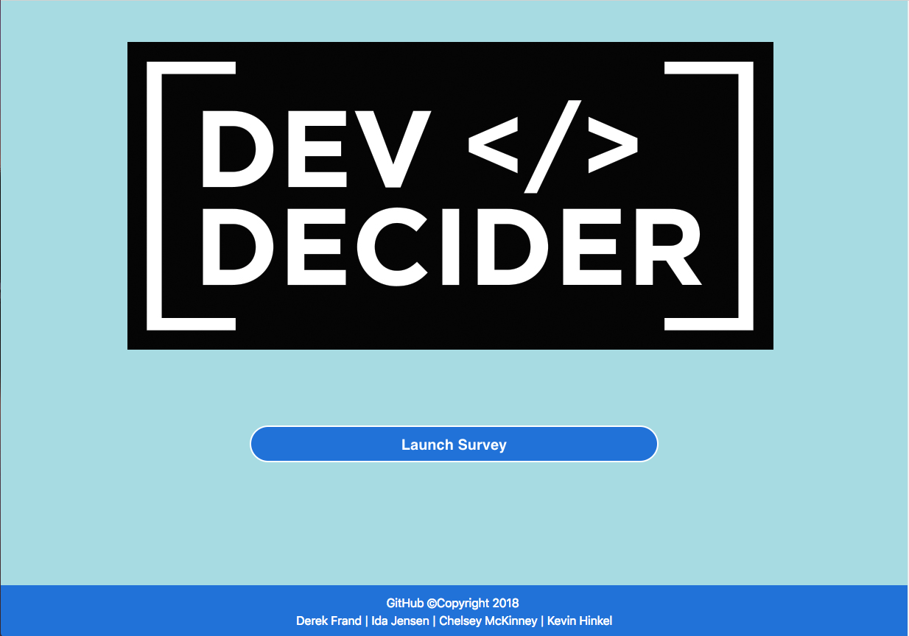

# Developer-Decider
A fun quiz style application that will pair you with one of the apps Developers. 

 ***
## Getting Started

 - Clone repo.
 - Run `npm install` in command line.
 - Run `node server.js` in command line.
 - Add your name and GitHub to our Sequelize database and get paired with one of the Developers here.

***
## Technologies Used:

 * Node.js
 * Express.js
 * MySQL
 * Sequelize
 * HTML5
 * CSS3

***
##  Installs

### Body-parser
 - `npm install body-parser`

### Express
 - `npm install express`

### MySQL
 - `npm install mysql`

### MySQL2
 - `npm install mysql2`

### Sequelize
 - `npm install sequelize`
***
## Heroku
You can try it out now at [Dev-Decider](https://#/).

***
## Contributors: 

 - Derek Frand [GitHub](https://github.com/Dfrand)
 - Ida Jensen [GitHub](https://github.com/idaselma3025)
 - Chelsey McKinney [GitHub](https://github.com/camckin10)
 - Kevin Hinkel [GitHub](https://github.com/kevinhinkel)
 